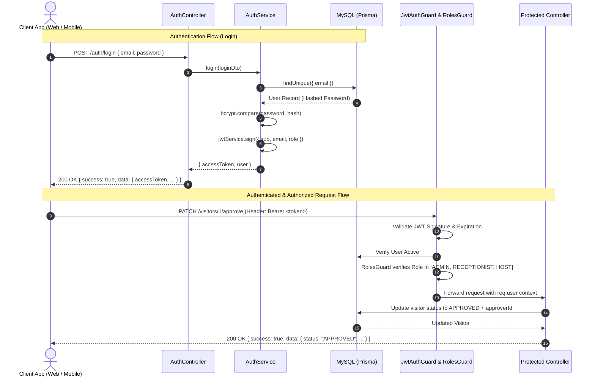

# System Architecture Document
## Visitor Management Mini System

### 1. Executive Summary
The **Visitor Management Mini System** is a backend RESTful service engineered with **NestJS**, **TypeScript**, **MySQL**, and **Prisma ORM**. The platform provides secure, real-time visitor check-in, host tracking, status approval workflows (`PENDING`, `APPROVED`, `REJECTED`), and role-based access control (`ADMIN`, `RECEPTIONIST`, `HOST`).

Designed following Clean Architecture and Domain-Driven Modular design principles, the API acts as a centralized backend capable of simultaneously powering **React Web Admin** dashboards, **Flutter Mobile** guest apps, and third-party kiosk integrations.

---

### 2. High-Level Architecture Diagram

```
┌─────────────────────────────────────────────────────────────────────────┐
│                           Client Ecosystem                              │
│   ┌─────────────────────┐   ┌───────────────────┐   ┌────────────────┐  │
│   │  React Web Admin    │   │  Flutter Mobile   │   │  Swagger UI /  │  │
│   │   (Staff / Admin)   │   │  (Host / Visitor) │   │    Postman     │  │
│   └──────────┬──────────┘   └─────────┬─────────┘   └───────┬────────┘  │
└──────────────┼────────────────────────┼─────────────────────┼───────────┘
               │                        │                     │
               ▼                        ▼                     ▼
┌─────────────────────────────────────────────────────────────────────────┐
│                       HTTP / REST Layer (JSON)                          │
│                                                                         │
│   ┌─────────────────────────────────────────────────────────────────┐   │
│   │ Middleware & Interceptors Pipeline                              │   │
│   │  1. CORS Handler                                                │   │
│   │  2. Global ValidationPipe (DTO Validation, Stripping, Transform)│   │
│   │  3. Global HttpExceptionFilter (Standardized Error Envelopes)   │   │
│   │  4. Global TransformInterceptor (Standardized Data Envelopes)   │   │
│   │  5. Swagger OpenAPI UI (/api/docs)                              │   │
│   └────────────────────────────────┬────────────────────────────────┘   │
│                                    │                                    │
│   ┌────────────────────────────────▼────────────────────────────────┐   │
│   │ Security & Authorization Layer                                  │   │
│   │  - JwtAuthGuard (Passport Bearer Strategy)                      │   │
│   │  - RolesGuard (@Roles Decorator for RBAC enforcement)           │   │
│   │  - @Public Decorator for Whitelisted Endpoints                  │   │
│   └────────────────────────────────┬────────────────────────────────┘   │
│                                    │                                    │
│   ┌────────────────────────────────▼────────────────────────────────┐   │
│   │ Modular Controllers Layer                                       │   │
│   │  - AuthController     (/auth/login, /auth/register, /auth/me)   │   │
│   │  - VisitorsController (/visitors, /visitors/:id, /approve)      │   │
│   │  - UsersController    (/users, /users/:id)                      │   │
│   └────────────────────────────────┬────────────────────────────────┘   │
│                                    │                                    │
│   ┌────────────────────────────────▼────────────────────────────────┐   │
│   │ Business Logic Layer (Services)                                 │   │
│   │  - AuthService     (Password Hashing, Token Generation)         │   │
│   │  - VisitorsService (Workflow Management, Filtering, Approvals)  │   │
│   │  - UsersService    (Staff Management, Role Provisioning)        │   │
│   └────────────────────────────────┬────────────────────────────────┘   │
│                                    │                                    │
│   ┌────────────────────────────────▼────────────────────────────────┐   │
│   │ Data Access Layer (Prisma ORM)                                  │   │
│   │  - PrismaService (Connection Pooling, Transaction Management)   │   │
│   │  - Query Builder & Type-Safe Generated Models                   │   │
│   └────────────────────────────────┬────────────────────────────────┘   │
└────────────────────────────────────┼────────────────────────────────────┘
                                     │ TCP Port 3306
                                     ▼
┌─────────────────────────────────────────────────────────────────────────┐
│                         MySQL Database Engine                           │
│   - `users` (id, email, password, name, role, department, phone)        │
│   - `visitors` (id, fullName, email, phone, status, host, approver)     │
└─────────────────────────────────────────────────────────────────────────┘
```

---

### 3. Layer Breakdown & Responsibilities

#### 3.1 Controller Layer
* Defines REST endpoints, routing, and HTTP verb mappings.
* Enforces HTTP status codes (`200 OK`, `201 Created`, `400 Bad Request`, `401 Unauthorized`, `403 Forbidden`, `404 Not Found`).
* Consumes strongly-typed DTOs validated before reaching the service layer.
* Emits Swagger metadata decorators for interactive API exploration.

#### 3.2 Service Layer (Business Logic)
* Encapsulates all domain rules, state transitions, and validation invariants.
* Hashes passwords using `bcrypt` (10 rounds).
* Enforces visitor state transition rules (e.g., recording the approving staff member and timestamp).
* Implements robust multi-column search and dynamic SQL filtering via Prisma.

#### 3.3 Data Access Layer (Prisma ORM & MySQL)
* Type-safe schema definition with automated TypeScript client code generation.
* Indexes on frequently queried columns (`status`, `email`, `phone`).
* Foreign-key referential integrity (`User.hostedVisitors`, `User.approvedVisitors`).

---

### 4. Authentication & Authorization Flow



---

### 5. Standardized Response Envelope Specification

#### Success Envelope
```json
{
  "success": true,
  "statusCode": 200,
  "message": "Visitor status successfully updated to APPROVED",
  "data": {
    "id": 1,
    "fullName": "Alice Johnson",
    "email": "alice.johnson@techpartner.com",
    "phone": "+1-555-111-2233",
    "status": "APPROVED",
    "approvedById": 1,
    "approvedAt": "2026-09-11T09:30:00.000Z"
  }
}
```

#### Error Envelope
```json
{
  "success": false,
  "statusCode": 400,
  "error": "Bad Request",
  "message": [
    "email must be an email",
    "fullName should not be empty"
  ],
  "timestamp": "2026-09-11T09:30:00.000Z",
  "path": "/visitors"
}
```

---

### 6. Design for React Web Admin & Flutter Mobile Integration

1. **Stateless JWT Tokens**: Easy storage in browser `localStorage`/`secure cookies` for React and `flutter_secure_storage` for Flutter.
2. **CORS & Preflight**: Configured to accept requests from web dev servers (`http://localhost:3000`, `http://localhost:5173`) and mobile origins.
3. **Structured Pagination**: Standard metadata (`page`, `limit`, `total`, `totalPages`, `hasNextPage`) enables infinite scrolling and tabular data grids.
4. **Role Filtering**: Front-desk kiosk tablets can display instant check-in, while management dashboards have access to full search, deletion, and analytics.
