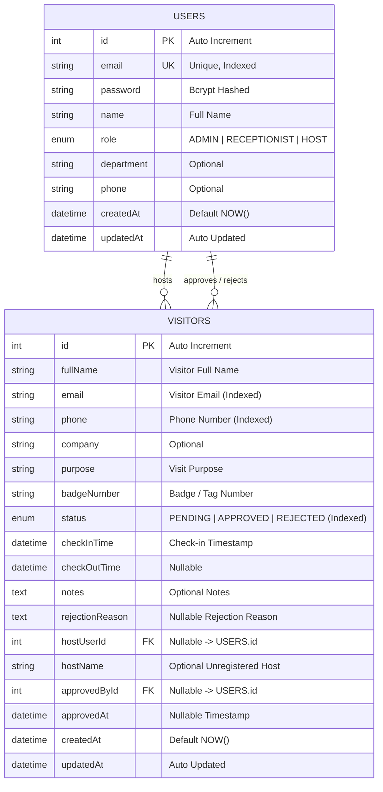

# Entity Relationship (ER) Diagram
## Visitor Management Mini System

### 1. Visual Entity Relationship Diagram

---

### 2. Table Schemas & Data Dictionary

#### 2.1 `users` Table
Stores internal employees, hosts, front-desk receptionists, and system administrators.

| Column Name | Data Type | Modifiers | Description |
| :--- | :--- | :--- | :--- |
| `id` | `INT` | `PK`, `AUTO_INCREMENT` | Unique identifier for user |
| `email` | `VARCHAR(191)` | `UNIQUE`, `NOT NULL` | User email for authentication |
| `password` | `VARCHAR(255)` | `NOT NULL` | Bcrypt hashed password |
| `name` | `VARCHAR(191)` | `NOT NULL` | Full name of the user |
| `role` | `ENUM` | `NOT NULL`, `DEFAULT 'RECEPTIONIST'` | `ADMIN`, `RECEPTIONIST`, `HOST` |
| `department`| `VARCHAR(191)` | `NULL` | Department (e.g. IT, HR, Engineering) |
| `phone` | `VARCHAR(191)` | `NULL` | Contact phone number |
| `createdAt` | `DATETIME(3)` | `NOT NULL`, `DEFAULT NOW()` | Record creation timestamp |
| `updatedAt` | `DATETIME(3)` | `NOT NULL` | Last update timestamp |

---

#### 2.2 `visitors` Table
Stores external visitor check-in logs, host assignments, statuses, and approval history.

| Column Name | Data Type | Modifiers | Description |
| :--- | :--- | :--- | :--- |
| `id` | `INT` | `PK`, `AUTO_INCREMENT` | Unique visitor record ID |
| `fullName` | `VARCHAR(191)` | `NOT NULL` | Full name of visitor |
| `email` | `VARCHAR(191)` | `NOT NULL`, `INDEX` | Email address of visitor |
| `phone` | `VARCHAR(191)` | `NOT NULL`, `INDEX` | Phone number of visitor |
| `company` | `VARCHAR(191)` | `NULL` | Organization / company name |
| `purpose` | `VARCHAR(191)` | `NOT NULL` | Purpose of the visit |
| `badgeNumber` | `VARCHAR(191)` | `NULL` | Physical badge or tag code |
| `status` | `ENUM` | `NOT NULL`, `DEFAULT 'PENDING'`, `INDEX` | `PENDING`, `APPROVED`, `REJECTED` |
| `checkInTime` | `DATETIME(3)` | `NOT NULL`, `DEFAULT NOW()` | Check-in timestamp |
| `checkOutTime`| `DATETIME(3)` | `NULL` | Check-out timestamp |
| `notes` | `TEXT` | `NULL` | Additional remarks or requirements |
| `rejectionReason` | `TEXT` | `NULL` | Stated reason when status is `REJECTED` |
| `hostUserId` | `INT` | `NULL`, `FK -> users.id` | Host employee user ID |
| `hostName` | `VARCHAR(191)` | `NULL` | Direct host name if unregistered user |
| `approvedById`| `INT` | `NULL`, `FK -> users.id` | Approving user ID |
| `approvedAt` | `DATETIME(3)` | `NULL` | Timestamp when approved or rejected |
| `createdAt` | `DATETIME(3)` | `NOT NULL`, `DEFAULT NOW()` | Record creation timestamp |
| `updatedAt` | `DATETIME(3)` | `NOT NULL` | Last update timestamp |

---

### 3. Relationships & Cardinality

1. **Host-to-Visitor (1:N)**:
   - One `User` (Host) can host many `Visitors`.
   - On host deletion (`onDelete: SetNull`), historical visitor records retain their logs with `hostUserId` set to `NULL`.

2. **Approver-to-Visitor (1:N)**:
   - One `User` (Admin / Staff) can approve or reject many `Visitors`.
   - On approver deletion (`onDelete: SetNull`), the approval record preserves auditability with `approvedById` set to `NULL`.
